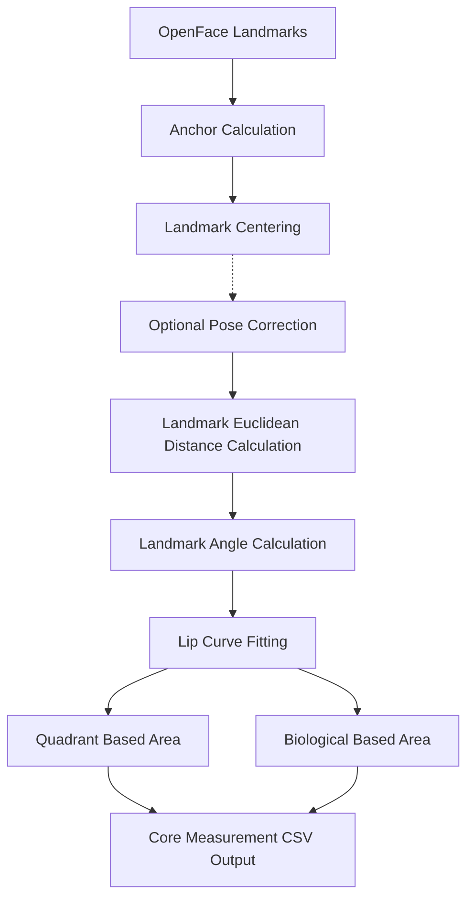

[](https://www.rust-lang.org/)
[]()


# Motor-Oral Speech Analysis & Integrated Computation (MOSAIC)

Motor-Oral Speech Analysis & Integrated Computation (MOSAIC) is a mathematical system which tracks mouth and jaw movement and correlates those measurements to a [parselmouth/praat](https://parselmouth.readthedocs.io/en/stable/#) analysis. MOSAIC has three measurement "units": core measurements, complex measurements, and praat based measurements. 


## UPDATE:
Version 0.3.2-alpha - MOSAIC now creates it's own Venv for python so it can run parselmouth. 

### All Information Below is Based on the Python Version:

## Core measurements
Core measurements serve as the backbone for the higher-level measurements used in facial tracking. It follows a simple pipiline.


Uncertainty is calculated for all metrics based off the standard deviation of landmark coordinates through a calibration sequence.

## Complex measurements
Complex measurements can be split into two categories: Temporal measurements and Motor Geometry. 

### Temporal measurements
As the name suggests, these are time-based metrics such as velocity, acceleration, jerk, commissure drift, lip open/close velocity, etc. These are exported to a temporal measurement csv file.

### Motor Geometry
Motor Geometry measures oromotor control and consists of several modules such as commissure angle deviation, commissure rotation, and curvature metrics.

## Praat analysis
Praat analysis compares the movement of the mouth to what the mouth is doing. For example: VOT, pitch (F0), phonation, and vowel analysis (F1, F2).


## Acknowledgements

 - Joshua Woodhouse, University of York - For contributions to the anchor/centering logic, uncertainty propagation, and curvature.


## API Reference
I have never written an API reference before so please email me using the author information below for any changes (or submit a pull request I think).

#### Installing MOSAIC

```http
  pip install https://github.com/Harry-S-W/MOSAIC.git
```

#### Using MOSAIC
MOSAIC Uses a REPL (under heavy development) to make the CLI as intuitive as possible

To access the shell:
```http
  > mosaic
```
You are now in the MOSAIC environment and your terminal will look like the following, assuming you are not in any project, participant, or trial directory.

```http
MOSAIC (no project) >
```

The prompt is dynamic and will change based on where you are within an MOSAIC project and it is stateful. For example

```http
MOSAIC (no project) > add project "project path" "project name"

Project "project name" created at "project path"

MOSAIC project name >
```

This pattern is followed when accessing participant and trial directories as well.


## Authors

- Harry Woodhouse, University of York - [Github: @Harry-S-W](https://github.com/Harry-S-W), [Website:](https://harrywstephen.com)


## License

[GLPv3](https://www.gnu.org/licenses/licenses.html)


## Contributing

Contributions are always welcome!

Just submit a pull request! (At least I think that is what you're supposed to do!)

